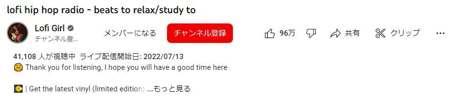

# YoutubeRevertUI

Revert Youtube UI back.

## Install

Select manifest_v3.zip for [releases](https://github.com/fa0311/YoutubeRevertUI/releases) and download the file.
Select Manage extensions in Chrome and enable Developer Mode, then drag the downloaded zip file onto the page.

## License

YoutubeRevertUI is under MIT License
